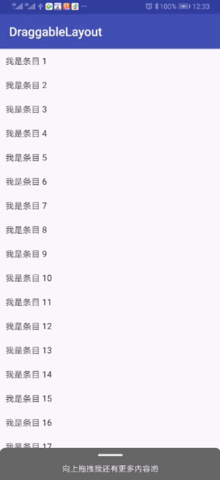

# DraggableLayout - 比较好用的抽屉布局。

#效果图



# 体验
[点击下载](https://fir.im/dkp9)或扫码下载DemoApk


# 下载
#### 第一步：添加 JitPack 仓库到你项目根目录的 gradle 文件中。
```
allprojects {
    repositories {
        ...
        maven { url 'https://jitpack.io' }
    }
}
```
#### 第二步：添加这个依赖。
```
dependencies {
    implementation 'com.github.kelinZhou:DraggableLayout:1.0.0'
}
```
# 使用
未完待续……